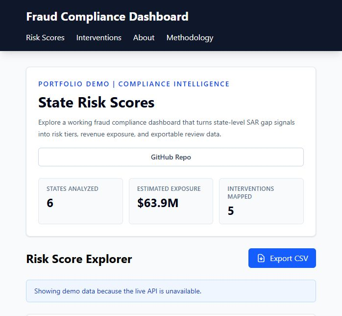
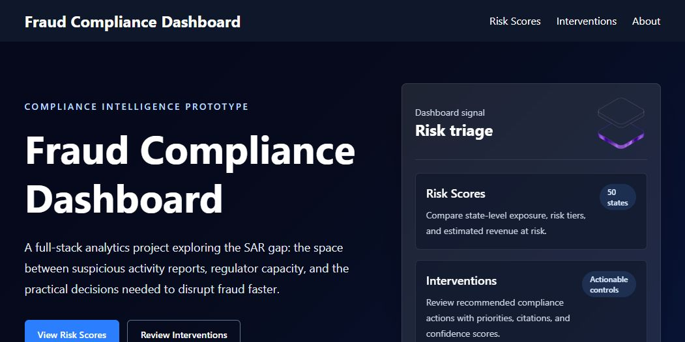
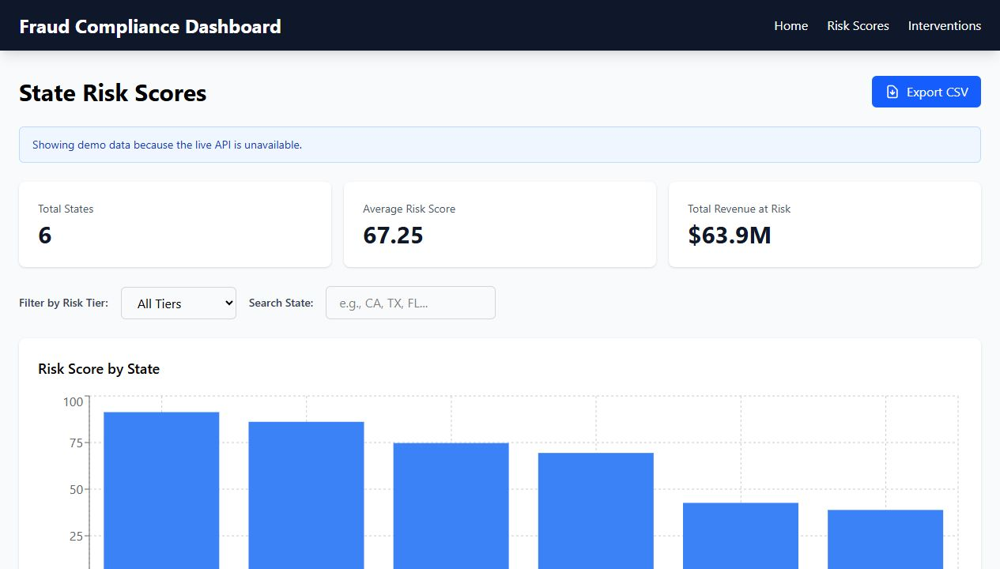
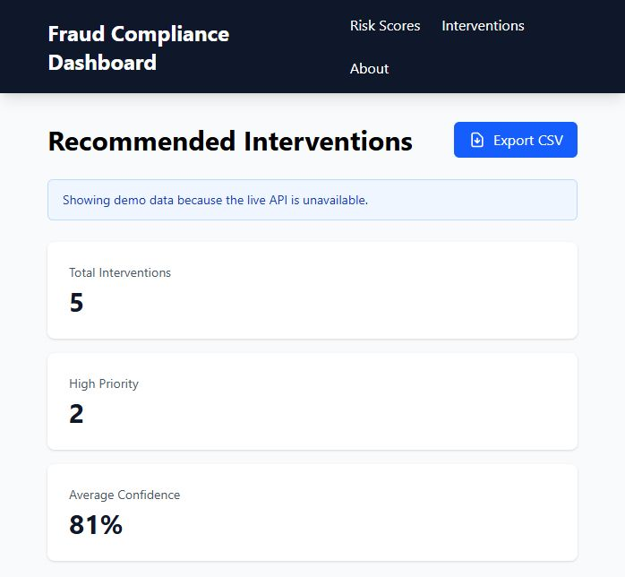
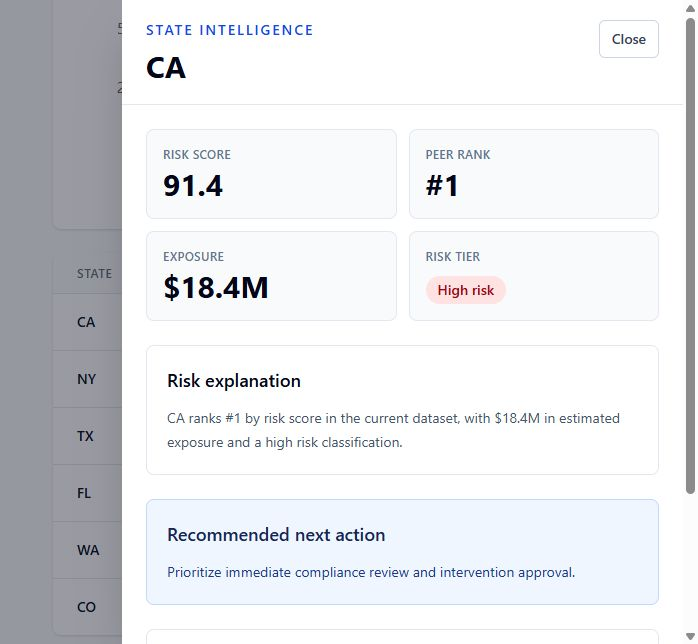
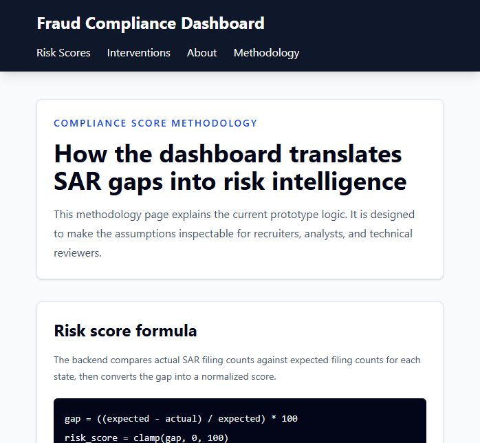

# Fraud Compliance Dashboard

A full-stack fraud compliance intelligence platform built with React, FastAPI, and Supabase. The project explores the "SAR gap": the disconnect between suspicious activity reporting volume and the regulator-ready intelligence needed to prioritize enforcement, controls, and fraud disruption.

**Live demo:** Deployed as a Vercel frontend with a Render-hosted FastAPI API.

## Screenshots

### Live Demo Entry



### About This Project



### Risk Scores



### Recommended Interventions



### State Drilldown



### Methodology



## What This Dashboard Does

- Scores state-level fraud and compliance risk.
- Groups states into high, medium, and low risk tiers.
- Estimates revenue at risk by state.
- Recommends compliance interventions with priority levels.
- Includes regulatory citations and confidence scores.
- Supports filtering, searching, sorting, chart review, and CSV export.
- Provides role-specific dashboard views for Executive, Analyst, and Operations users.
- Includes a guided demo tour for recruiters and reviewers.
- Shows a U.S. SAR filing map and SAR trend analytics from API-backed data.
- Presents the project context through a landing page for evaluators and users.
- Falls back to labeled demo data when the live API is unavailable during local review.
- Adds an executive intelligence feed that summarizes the current risk picture.
- Supports state drilldowns with explanation, peer rank, exposure, and recommended action.
- Documents the scoring model on a dedicated methodology page.

## What I Built

- React dashboard architecture with shared dashboard layout, responsive sidebar, route-level pages, and role-based views.
- FastAPI backend endpoints for risk scores, interventions, SAR filing analytics, and state-level drilldowns.
- Supabase-backed persistence for demo portfolio records and SAR filing data.
- Risk scoring, intervention workflow, export, demo fallback, and AI copilot interaction patterns.
- Deployment-ready frontend and backend configuration for Vercel and Render.

## Why It Matters

Suspicious Activity Reports are essential to anti-fraud oversight, but high filing volume does not automatically translate into rapid disruption. Institutions may file defensive or low-specificity SARs, regulators face constrained review capacity, and weak prioritization can leave severe patterns hidden in plain sight.

This project treats the SAR gap as both a policy problem and a product design problem: how can a compliance tool help analysts move from reporting volume to prioritized action?

## Tech Stack

| Layer | Technology |
| --- | --- |
| Frontend | React, React Router, Tailwind CSS, Recharts, Axios, Vite |
| Backend | FastAPI, Python |
| Database | Supabase |
| Analytics | Risk scoring and intervention service modules |
| Prototype support | Streamlit |
| Deployment targets | Vercel frontend, Render backend |

## Project Structure

```text
fraud-compliance-dashboard/
  backend/
    main.py
    database.py
    routers/
    services/
    tests/
  frontend/
    src/
      components/
      pages/
      services/
      assets/
    public/
  docs/
    PROJECT_DOCUMENTATION.md
    screenshots/
  streamlit/
  README.md
```

## Application Routes

| Route | Purpose |
| --- | --- |
| `/` | Public landing page and live demo entry point |
| `/dashboard` | Main risk score dashboard with KPI cards, filters, drilldowns, exports, and copilot |
| `/risk-map` | U.S. state-level SAR filing map |
| `/sar-analytics` | SAR filing trend analytics and top-state comparisons |
| `/interventions` | Recommended compliance interventions dashboard |
| `/about` | Project explanation, SAR gap context, architecture, and workflow |
| `/methodology` | Risk formula, tier thresholds, assumptions, and limitations |

## API Endpoints

| Method | Endpoint | Description |
| --- | --- | --- |
| `GET` | `/health` | Backend health check |
| `GET` | `/states` | Fetch state reference data |
| `GET` | `/risk/risk-scores` | Fetch saved risk scores |
| `POST` | `/risk/risk-scores/calculate` | Trigger risk score calculation |
| `GET` | `/interventions/` | Fetch all recommended interventions |
| `GET` | `/interventions/{state_code}` | Fetch interventions for one state |
| `POST` | `/interventions/generate` | Generate intervention recommendations |

## Database Tables

| Table | Purpose |
| --- | --- |
| `states` | Stores US states and regional classification |
| `sar_filings` | Stores actual and expected SAR filing counts by state and year |
| `risk_scores` | Stores computed state risk score, risk tier, and revenue at risk |
| `interventions` | Stores recommended compliance actions, priority levels, citations, and confidence scores |

## Local Setup

### Prerequisites

- Node.js and npm
- Python 3.11+
- Supabase project credentials

### Frontend

```bash
cd frontend
npm install
npm run dev
```

By default, the frontend expects the backend at `http://localhost:8000`. To point it elsewhere, create `frontend/.env`:

```bash
VITE_API_BASE_URL=http://localhost:8000
```

If the backend is unavailable, the Risk Scores and Interventions pages display labeled demo data so the dashboard can still be reviewed locally.

### Backend

```bash
cd backend
python -m venv .venv
.venv\Scripts\activate
pip install -r requirements.txt
uvicorn main:app --reload
```

The backend expects Supabase configuration in environment variables used by `backend/database.py`.

### Seed Demo Data

After configuring `backend/.env`, seed Supabase with portfolio demo records:

```bash
cd backend
python seed_demo_data.py
```

This writes a broader 15-state risk-score portfolio and intervention queue to `risk_scores` and `interventions`, so the deployed frontend can show real API-backed data instead of relying on local fallback data. Re-run this after creating or replacing a Supabase project.

## Methodology

The backend risk engine compares actual SAR filings against expected SAR filings for each state:

```text
gap percentage = ((expected_count - filing_count) / expected_count) * 100
risk score = gap percentage clamped from 0 to 100
```

Risk tiers are assigned from the score:

| Score range | Tier |
| --- | --- |
| `0-30` | Low |
| `30.01-60` | Medium |
| `60.01-100` | High |
 
Revenue at risk is stored as a separate estimated exposure field so the prototype can tune the business-impact model independently from the filing-gap score.

The live dashboard also includes a state drilldown drawer. Selecting a state exposes its peer rank, risk explanation, revenue exposure, and recommended next action.

## Verification

Run frontend checks:

```bash
cd frontend
npm run lint
npm run build
```

Run backend tests:

```bash
cd backend
pytest
```

## Documentation

Detailed documentation is available in [docs/PROJECT_DOCUMENTATION.md](docs/PROJECT_DOCUMENTATION.md).

## Current Status

This is an MVP-stage full-stack prototype with deployed frontend/backend workflows, API-backed demo data, responsive dashboard navigation, SAR analytics, intervention workflow controls, and documented methodology. The next phase is to strengthen backend test coverage, add authentication, and expand institution-level data modeling.

## Roadmap

- Add frontend component tests.
- Add stronger backend tests around risk and intervention engines.
- Add authentication for protected analyst workflows.
- Add deployment-specific environment documentation.
- Add state detail pages with risk history and intervention status.

## Deployment

### Frontend on Vercel

Deploy the `frontend/` directory as the Vercel project root.

Required setting:

```bash
VITE_API_BASE_URL=https://your-render-api-url.onrender.com
```

The frontend includes `frontend/vercel.json` for Vite build output and client-side route rewrites.

### Backend on Render

Render can use `render.yaml` from the repository root. Add these environment variables in Render:

```bash
SUPABASE_URL=your-supabase-project-url
SUPABASE_KEY=your-supabase-service-or-anon-key
```

After deploying the backend, run the seed script locally once against the same Supabase project:

```bash
cd backend
python seed_demo_data.py
```
